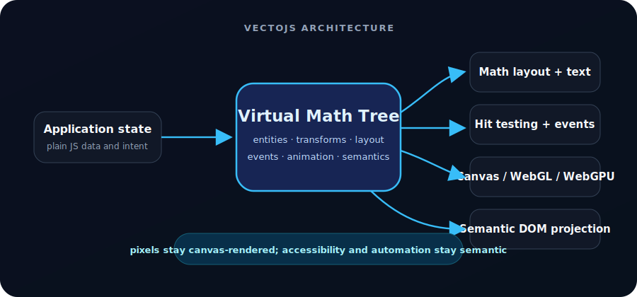

# VectoJS

> A canvas-native UI runtime: render like a scene engine, remain operable like the DOM.

[](https://github.com/vectojs/vectojs/actions/workflows/ci.yml)
[](./LICENSE)
[](https://www.npmjs.com/package/@vectojs/core)
[](https://www.npmjs.com/package/@vectojs/ui)
[](https://www.npmjs.com/package/@vectojs/three)
[](https://www.npmjs.com/package/@vectojs/video-exporter)

VectoJS draws a scene graph onto one `<canvas>`. Layout, hit-testing, animation, text flow, and
render scheduling operate on a Virtual Math Tree (VMT), while interactive entities project a thin
semantic DOM layer for accessibility and automation.

This is not an ECS and it does not claim allocation-free rendering. It is a retained-mode rendering
runtime for interfaces whose visual or interactive complexity is a poor fit for one DOM element per
shape, glyph, point, or row.

[Documentation](https://vectojs.xuepoo.xyz/learn/introduction/) ·
[Live demos](https://vectojs.xuepoo.xyz/demos/) ·
[Component reference](https://vectojs.xuepoo.xyz/reference/ui-components/) ·
[Issues](https://github.com/vectojs/vectojs/issues)

## Why VectoJS

- **Canvas-native visuals** — Canvas 2D is the default renderer; WebGL point batching and WebGPU
  compute paths cover high-volume workloads.
- **Semantic projection** — buttons, links, inputs, checkboxes, sliders, and other controls expose
  role/name/state through transparent DOM counterparts.
- **Real browser input** — `Input` and `TextArea` mirror native controls, preserving IME composition,
  selection, clipboard, undo, and automation APIs.
- **Mathematical interaction** — transforms, bounds, spatial hashing, event capture/bubble, clipping,
  and hit-testing live in one coordinate model.
- **Deterministic rendering tools** — on-demand redraw, fixed-step `Scene.step()`, and the video
  exporter support tests, simulations, and offline capture.
- **Framework-neutral** — mount a canvas from React, Vue, Svelte, vanilla TypeScript, or a Three.js
  scene; VectoJS does not own your application state.

## Packages

| Package                                                | Purpose                                                                                                                  |
| ------------------------------------------------------ | ------------------------------------------------------------------------------------------------------------------------ |
| [`@vectojs/core`](./packages/core)                     | Scene/Entity runtime, layout and text engine, events, hit-testing, accessibility projection, Canvas/WebGL/WebGPU support |
| [`@vectojs/ui`](./packages/ui)                         | Canvas-native layout, form, content, data, navigation, and overlay components                                            |
| [`@vectojs/three`](./packages/three)                   | Project a VectoJS scene onto a Three.js texture and route raycast/XR input back into 2D                                  |
| [`@vectojs/video-exporter`](./packages/video-exporter) | Fixed-step Chromium + FFmpeg H.264 MP4 export for local modules or hosted scenes                                         |

## Install

```bash
bun add @vectojs/core
bun add @vectojs/ui       # optional high-level components
```

The packages are standard ESM/CJS npm packages and also work with npm, pnpm, and yarn.

## Quick start

```html
<div id="app"><canvas id="canvas"></canvas></div>
<style>
  #app {
    position: relative;
    width: 100vw;
    height: 100vh;
  }
  canvas {
    display: block;
    width: 100%;
    height: 100%;
  }
</style>
```

```ts
import { Scene } from '@vectojs/core';
import { Button, Input, Stack, Text, Toggle } from '@vectojs/ui';

const canvas = document.querySelector<HTMLCanvasElement>('#canvas')!;
const scene = new Scene(canvas, { maxFPS: 60 });
scene.renderMode = 'onDemand';

const panel = new Stack({ direction: 'vertical', gap: 14 });
panel.setPosition(40, 40);
panel.add(new Text('Runtime settings', { font: '700 24px Inter' }));
panel.add(new Input({ width: 280, placeholder: 'Project name' }));
panel.add(new Toggle({ checked: true, label: 'GPU acceleration' }));
panel.add(
  new Button('Save', {
    onClick: () => console.log('saved'),
  }),
);

scene.add(panel);
scene.start();

window.addEventListener('resize', () => {
  scene.resize(window.innerWidth, window.innerHeight);
});

// Release renderers, workers, observers, and projected DOM when unmounting.
// scene.destroy();
```

The visual controls are canvas-rendered. Their semantic counterparts remain discoverable:

```ts
await page.getByRole('textbox', { name: 'Project name' }).fill('Nexus');
await page.getByRole('button', { name: 'Save' }).click();
```

## Architecture

<p align="center">
  
</p>

The DOM projection is deliberately not the visual renderer. It carries semantics and native input;
the canvas remains the source of visible pixels.

## Where it fits

Good candidates:

- infinite canvases, graphs, timelines, whiteboards, node editors;
- dense dashboards, traces, order books, virtualized data, streaming output;
- particle fields, simulations, educational/diagramming tools;
- 2D panels embedded in Three.js/WebXR;
- interfaces that need both canvas scale and role-based accessibility/automation.

Prefer ordinary HTML/CSS for document-first pages, SEO-heavy prose, native text selection, small
static forms, or applications that do not benefit from a retained scene graph.

## Render and interaction model

1. Add `Entity` instances to a `Scene`.
2. Layout resolves local boxes and transforms.
3. Dirty scenes render through the selected backend.
4. Pointer input is mapped into scene coordinates, spatially queried, then dispatched through
   capture and bubble phases.
5. Interactive entities synchronize role/name/state and native input through the semantic layer.

Read the [core guide](https://vectojs.xuepoo.xyz/learn/core-scene/) for lifecycle and rendering, and
the [accessibility guide](https://vectojs.xuepoo.xyz/learn/accessibility/) before shipping controls.

## Demos

The separate [vectojs-website](https://github.com/vectojs/vectojs-website) repository hosts live,
source-available stress tests:

- large danmaku streams and WebGPU particle fields;
- streaming Markdown/chat rendering;
- a knowledge graph and Canvas-vs-DOM comparison;
- a VectoJS panel embedded in a Three.js scene;
- game-style pointer and keyboard interaction.

Performance depends on renderer, entity shape, text, hardware, and workload. Use the checked-in
benchmarks instead of treating demo counts as universal guarantees.

## Development and verification

```bash
bun install
bun run build
bun run test
oxlint --deny-warnings .
prettier --check "**/*.{js,ts,json,md,html,yaml}"
knip
```

Additional reproducible workloads:

```bash
bun run benchmark     # real browser frame-time workloads
bun run compare:dom   # CDP layout/style/heap comparison
bun run compare       # text-layout comparison
```

The project is pre-1.0. Read package changelogs before upgrading and pin versions in production.

## License

[MIT](./LICENSE) © 2026 Xuepoo
